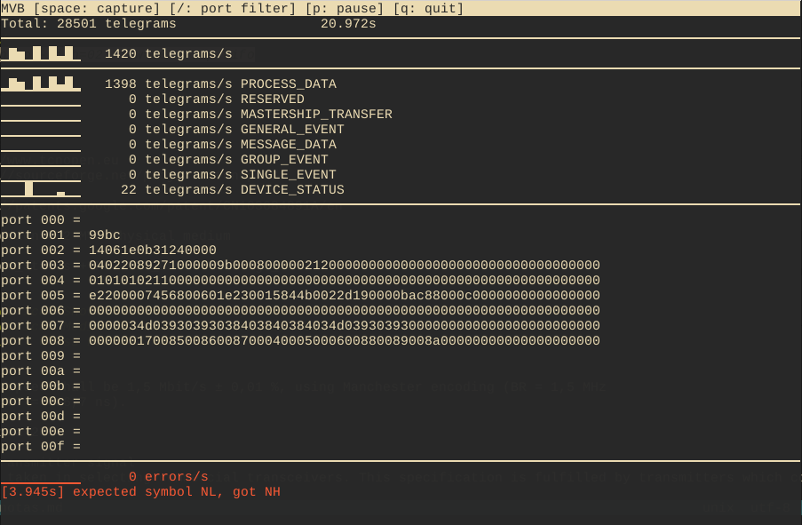
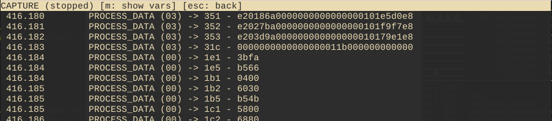
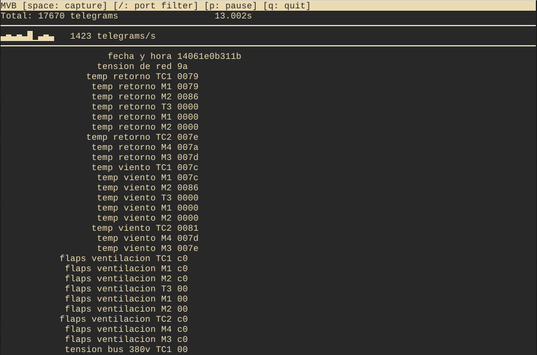

# Software para captura en tiempo real de tramas MVB

Este software permite capturar el tráfico de la red MVB en tiempo real, con el
objetivo de:

* Monitorear el estado de todas las variables de las formaciones desde un centro de
control.
* Almacenar el historial de una o más variables de importancia.

El sistema ofrece dos modos de uso, que se detallan a continuación.

## Modo interactivo



El modo interactivo permite visualizar en tiempo real:

* El valor actual de todas las variables MVB (por ejemplo, en la captura, la
  variable en el puerto `001` tiene valor `0x99bc`).
* La frecuencia de tramas de cada uno de los tipos (por ejemplo 22 tramas por
  segundo de tipo `DEVICE_STATUS`).
* La frecuencia y el historial de errores de decodificación.

Además permite iniciar y detener una captura presionando una tecla, de forma
tal de visualizar el detalle de los eventos producidos entre el inicio y fin de
la misma:



También es posible definir un conjunto de variables conocidas a visualizar, y
mostrarlas ocultando el resto:



## Modo de almacenamiento

En el modo de almacenamiento, el software toma como entrada un conjunto de
variables conocidas y guarda en tiempo real la evolución de dichas variables,
produciendo una carpeta por cada día de captura, y en cada carpeta un archivo
CSV por cada variable capturada.

Por ejemplo, la estructura de archivos resultante tendrá la siguiente forma:

```
.
├── 2022-07-05
│   ├── 002-0-6-fecha-y-hora.csv
│   ├── 003-8-9-tension-de-red.csv
│   ├── 006-10-12-carga-TC1.csv
│   ├── 006-12-14-carga-M1.csv
│   ├── 006-14-16-carga-M2.csv
...
├── 2022-07-09
│   ├── 002-0-6-fecha-y-hora.csv
│   ├── 003-8-9-tension-de-red.csv
│   ├── 006-10-12-carga-TC1.csv
│   ├── 006-12-14-carga-M1.csv
│   ├── 006-14-16-carga-M2.csv
│   ├── 006-16-18-carga-T3.csv
...
```

donde, por ejemplo, el archivo `002-0-6-fecha-y-hora.csv` contiene:

```
14:05:53.214,14061e0b310f
14:05:53.535,14061e0b3110
14:05:54.611,14061e0b3111
14:05:55.567,14061e0b3112
14:05:56.552,14061e0b3113
14:05:57.545,14061e0b3114
14:05:58.444,14061e0b3115
14:05:59.447,14061e0b3116
14:06:00.477,14061e0b3117
```

Cada línea tiene el formato: `<timestamp>,<valor>`. Para conservar espacio,
mientras la variable no cambie de valor no se agregan líneas al archivo CSV.
